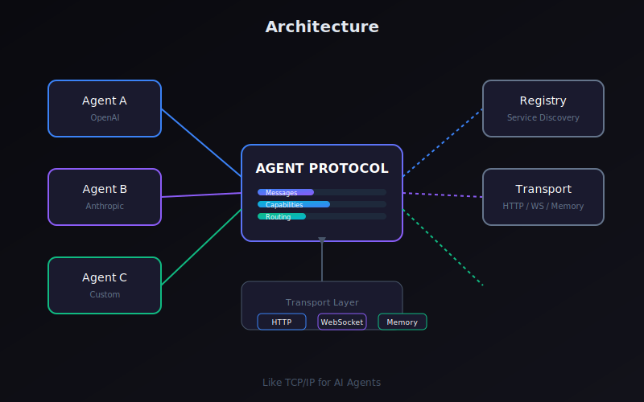

# Agent Protocol

<p align="center">
  
</p>

<p align="center">
  <strong>Universal protocol for AI agent communication</strong>
</p>

<p align="center">
  <em>Like TCP/IP is to the internet, Agent Protocol is for AI agents.</em>
</p>

<p align="center">
  <a href="https://github.com/moggan1337/agent-protocol/blob/main/LICENSE">
    
  </a>
  <a href="https://www.npmjs.com/package/agent-protocol">
    
  </a>
</p>

---

## 🚀 What is Agent Protocol?

Agent Protocol is a universal communication standard that enables AI agents to:

- **Discover** each other's capabilities
- **Communicate** through standardized messages
- **Route** messages intelligently
- **Collaborate** on complex tasks

## ✨ Features

| Feature | Description |
|---------|-------------|
| **Universal Messages** | Standardized message types for all agent interactions |
| **Capability Discovery** | Agents advertise and discover each other's abilities |
| **Smart Routing** | Intelligent message routing with load balancing |
| **Multi-Transport** | HTTP, WebSocket, and in-memory transport support |
| **Service Registry** | Built-in service discovery and registration |
| **Type-Safe** | Full TypeScript support with type definitions |

---

## 📦 Installation

```bash
npm install agent-protocol
```

Or clone and build:

```bash
git clone https://github.com/moggan1337/agent-protocol.git
cd agent-protocol
npm install
npm run build
```

---

## ⚡ Quick Start

### Create an Agent

```typescript
import { Agent } from 'agent-protocol';

const agent = new Agent({
  id: 'my-agent',
  name: 'My Agent',
  capabilities: ['text', 'reasoning', 'code-execution']
});

agent.start();
```

### Send Messages

```typescript
// Send a request
const response = await agent.send({
  to: 'other-agent',
  type: 'request',
  content: 'What is the weather?'
});

// Broadcast to all agents
await agent.broadcast({
  type: 'announcement',
  content: 'I am now online!'
});
```

### Create a Server

```typescript
import { createServer } from 'agent-protocol';

const server = createServer({
  port: 3000,
  agents: [myAgent]
});

server.start();
```

---

## 🏗️ Architecture



### Components

```
┌─────────────────────────────────────────────────────────────┐
│                      Agent Protocol                         │
├─────────────────────────────────────────────────────────────┤
│                                                             │
│  ┌─────────┐  ┌─────────┐  ┌─────────┐  ┌─────────┐        │
│  │ Message │  │ Router  │  │Registry │  │Transport│        │
│  │  Types  │  │         │  │         │  │         │        │
│  └────┬────┘  └────┬────┘  └────┬────┘  └────┬────┘        │
│       │            │            │            │                │
│       └────────────┼────────────┼────────────┘                │
│                    │            │                            │
│              ┌─────┴────────────┴─────┐                      │
│              │      Agent Class       │                      │
│              └────────────────────────┘                      │
└─────────────────────────────────────────────────────────────┘
```

---

## 📚 API Reference

### Agent

```typescript
import { Agent, AgentConfig } from 'agent-protocol';

const config: AgentConfig = {
  id: 'unique-agent-id',
  name: 'Agent Name',
  capabilities: ['text', 'reasoning', 'tool-use'],
  metadata: {
    version: '1.0.0',
    author: 'developer'
  }
};

const agent = new Agent(config);

// Lifecycle
agent.start(): void
agent.stop(): void
agent.pause(): void
agent.resume(): void

// Messaging
agent.send(message: OutboundMessage): Promise<InboundMessage>
agent.broadcast(message: OutboundMessage): Promise<void>
agent.reply(to: string, content: string): Promise<void>

// Capabilities
agent.hasCapability(cap: string): boolean
agent.addCapability(cap: string): void
agent.removeCapability(cap: string): void
```

### Messages

```typescript
// Message types
type MessageType = 
  | 'request'      // Ask for information/action
  | 'response'     // Respond to a request
  | 'announcement' // Broadcast to all
  | 'event'        // System events
  | 'error'        // Error reporting
  | 'discovery'    // Capability discovery
  | 'heartbeat';   // Keep-alive

// Message structure
interface Message {
  id: string;           // Unique message ID
  from: string;         // Sender agent ID
  to: string;           // Recipient agent ID
  type: MessageType;    // Message type
  content: any;         // Message payload
  timestamp: number;    // Send time
  metadata?: Record<string, any>;
}

// Create a message
const msg = createMessage({
  from: 'agent-a',
  to: 'agent-b',
  type: 'request',
  content: { query: 'status' }
});
```

### Router

```typescript
import { Router } from 'agent-protocol';

const router = new Router();

// Add route
router.addRoute({
  pattern: '/agents/*/status',
  handler: async (ctx) => {
    return { status: 'online' };
  }
});

// Route a message
const result = await router.route(message);
```

### Registry

```typescript
import { Registry } from 'agent-protocol';

const registry = new Registry();

// Register an agent
registry.register({
  id: 'agent-1',
  name: 'Agent One',
  capabilities: ['text', 'reasoning']
});

// Discover agents
const agents = registry.discover({
  capabilities: ['reasoning']
});

// Get agent info
const agent = registry.get('agent-1');
```

### Transport

```typescript
import { createTransport, TransportType } from 'agent-protocol';

// HTTP Transport
const httpTransport = createTransport(TransportType.HTTP, {
  host: 'localhost',
  port: 3000
});

// WebSocket Transport
const wsTransport = createTransport(TransportType.WebSocket, {
  port: 3001
});

// Memory Transport (for same-process communication)
const memoryTransport = createTransport(TransportType.Memory);

// Send messages
await httpTransport.send(message);
await wsTransport.broadcast(message);
```

---

## 🔄 Multi-Agent Communication

### Example: Agent-to-Agent Chat

```typescript
import { Agent, createServer } from 'agent-protocol';

// Create agents
const agentA = new Agent({
  id: 'agent-a',
  name: 'Agent A',
  capabilities: ['text']
});

const agentB = new Agent({
  id: 'agent-b',
  name: 'Agent B', 
  capabilities: ['reasoning']
});

// Register message handlers
agentA.on('message', async (msg) => {
  console.log('Agent A received:', msg.content);
  await agentA.reply(msg.from, `Echo: ${msg.content}`);
});

agentB.on('message', async (msg) => {
  console.log('Agent B received:', msg.content);
  await agentB.reply(msg.from, `Processed: ${msg.content}`);
});

// Start server
const server = createServer({
  port: 3000,
  agents: [agentA, agentB]
});

server.start();

// Send message from A to B
const response = await agentA.send({
  to: 'agent-b',
  type: 'request',
  content: 'Hello from A!'
});
```

---

## 🌐 HTTP Server Example

```typescript
import { createHTTPServer } from 'agent-protocol';

const server = createHTTPServer({
  port: 3000,
  agents: [myAgent]
});

server.start();

// Endpoints available:
// POST /api/messages - Send a message
// GET  /api/agents    - List all agents
// GET  /api/agents/:id - Get agent info
// POST /api/broadcast - Broadcast message
```

---

## 🧪 Testing

```bash
npm test
```

---

## 📁 Project Structure

```
agent-protocol/
├── src/
│   ├── agent.ts         # Base agent class
│   ├── messages.ts      # Message types
│   ├── protocol.ts      # Protocol definitions
│   ├── registry.ts      # Service registry
│   ├── router.ts        # Message routing
│   ├── transport.ts     # Transport layer
│   └── index.ts         # Exports
├── examples/
│   ├── basic-agent.ts
│   ├── multi-agent-chat.ts
│   └── http-server.ts
├── logo.svg
├── architecture.svg
├── package.json
├── tsconfig.json
└── README.md
```

---

## 🤝 Contributing

Contributions welcome! Please read our [Contributing Guide](CONTRIBUTING.md).

1. Fork the repository
2. Create your feature branch (`git checkout -b feature/amazing`)
3. Commit your changes (`git commit -m 'Add amazing feature'`)
4. Push to the branch (`git push origin feature/amazing`)
5. Open a Pull Request

---

## 📄 License

MIT License - see [LICENSE](LICENSE)

---

<p align="center">
  <strong>Building the foundation for agent communication</strong>
</p>
