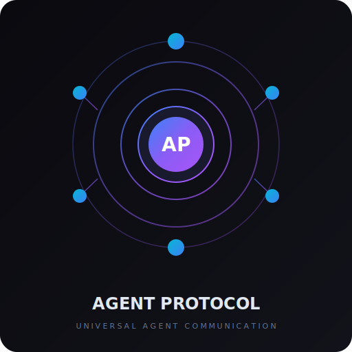

# Agent Protocol

<p align="center">
  
</p>

<p align="center">
  <strong>The Universal Protocol for AI Agent Communication</strong>
</p>

<p align="center">
  Like TCP/IP is to the internet, Agent Protocol is to AI agents.
</p>

<p align="center">
  <a href="https://github.com/moggan1337/agent-protocol/blob/main/LICENSE">
    
  </a>
  <a href="https://github.com/moggan1337/agent-protocol/actions">
    
  </a>
  <a href="https://www.npmjs.com/package/agent-protocol">
    
  </a>
  <a href="https://deno.land/x/agent_protocol">
    
  </a>
</p>

---

## 🎯 What is Agent Protocol?

**Agent Protocol** is a universal standard for AI agent communication. Just as TCP/IP enables different computers to communicate across the internet, Agent Protocol enables different AI agents—from any framework, provider, or platform—to discover, communicate, and collaborate.

### The Problem

Today, every AI agent framework speaks a different language:

```
OpenAI Agent → Cannot talk to → Anthropic Agent
Claude Code → Cannot talk to → AutoGPT Agent
LangChain Agent → Cannot talk to → Custom Agent
```

This fragmentation prevents agents from:
- 🔌 **Interoperating** across frameworks
- 🔍 **Discovering** each other's capabilities
- 🤝 **Collaborating** on complex tasks
- 📦 **Composing** multi-agent workflows

### The Solution

Agent Protocol creates a universal "language" that all agents can speak:

```
┌─────────────┐      ┌─────────────────┐      ┌─────────────┐
│   OpenAI    │      │   Agent        │      │  Anthropic  │
│   Agent     │◄────►│   Protocol     │◄────►│   Agent     │
└─────────────┘      └─────────────────┘      └─────────────┘
                            │
                            ▼
                     ┌─────────────┐
                     │ Local/LLM   │
                     │ Agent       │
                     └─────────────┘
```

---

## 🚀 Features

| Feature | Description |
|---------|-------------|
| **Universal Messages** | Standard message format for all agent types |
| **Capability Discovery** | Agents can query each other's capabilities |
| **Agent Registry** | Central or distributed service discovery |
| **Smart Routing** | Route messages to appropriate agents |
| **Load Balancing** | Distribute requests across agents |
| **Multiple Transports** | HTTP, WebSocket, Memory, gRPC |
| **Streaming Support** | Real-time streaming responses |
| **Type Safety** | Full TypeScript support |

---

## 📦 Quick Start

### Installation

```bash
# npm
npm install agent-protocol

# yarn
yarn add agent-protocol

# pnpm
pnpm add agent-protocol

# deno
import { Agent, MemoryTransport } from "https://deno.land/x/agent_protocol/mod.ts";
```

### Create Your First Agent

```typescript
import { Agent, AgentIdentity, Capability, MemoryTransport } from 'agent-protocol';

// Define your agent
const identity: AgentIdentity = {
  id: 'my-agent',
  name: 'My AI Agent',
  version: '1.0.0',
  type: 'agent',
};

const capabilities: Capability[] = [
  {
    name: 'chat',
    version: '1.0.0',
    description: 'Natural language conversation',
    inputTypes: ['text'],
    outputTypes: ['text'],
  },
];

// Create agent
const agent = new Agent({
  identity,
  capabilities,
  endpoint: 'memory://my-agent',
});

// Register a handler
agent.registerHandler('chat', async (request) => {
  const userMessage = request.content[0] as { text: string };
  
  // Your AI logic here
  const response = `You said: ${userMessage.text}`;
  
  return {
    id: crypto.randomUUID(),
    type: 'response',
    timestamp: Date.now(),
    version: '1.0.0',
    requestId: request.requestId,
    status: 'success',
    content: [{ type: 'text', text: response }],
  };
});

// Start the agent
await agent.start();
```

### Connect Two Agents

```typescript
import { Agent, AgentRegistry, Router, MemoryTransport } from 'agent-protocol';

// Create registry
const registry = new AgentRegistry({ name: 'local', type: 'local' });
await registry.start();

// Create agents
const agent1 = new Agent({ identity: { id: 'agent-1', name: 'Agent 1' }, ... });
const agent2 = new Agent({ identity: { id: 'agent-2', name: 'Agent 2' }, ... });

// Register agents
await registry.register(agent1.getInfo());
await registry.register(agent2.getInfo());

// Create router
const router = new Router({
  registry,
  transport: new MemoryTransport(),
});

await router.start();

// Send message from agent1 to agent2
const response = await router.route({
  type: 'request',
  action: 'process',
  recipient: { id: 'agent-2', name: 'Agent 2' },
  content: [{ type: 'text', text: 'Hello!' }],
});
```

---

## 🏗️ Architecture

```
┌─────────────────────────────────────────────────────────────────┐
│                        Agent Protocol                            │
├─────────────────────────────────────────────────────────────────┤
│                                                                  │
│  ┌──────────────┐  ┌──────────────┐  ┌──────────────┐         │
│  │   Messages   │  │    Agent     │  │   Registry   │         │
│  │              │  │              │  │              │         │
│  │ • Request    │  │ • Identity    │  │ • Discovery  │         │
│  │ • Response   │  │ • Capabilities│  │ • Health    │         │
│  │ • Stream    │  │ • Handlers   │  │ • Matching  │         │
│  │ • Discovery  │  │ • Events     │  │ • Cleanup   │         │
│  └──────────────┘  └──────────────┘  └──────────────┘         │
│                                                                  │
│  ┌──────────────┐  ┌──────────────┐                              │
│  │    Router    │  │  Transport   │                              │
│  │              │  │              │                              │
│  │ • Routing    │  │ • HTTP       │                              │
│  │ • Load       │  │ • WebSocket  │                              │
│  │   Balancing  │  │ • Memory     │                              │
│  │ • Failover   │  │ • gRPC      │                              │
│  └──────────────┘  └──────────────┘                              │
│                                                                  │
└─────────────────────────────────────────────────────────────────┘
```

### Core Components

| Component | Purpose |
|-----------|---------|
| **Messages** | Universal message format for all communication |
| **Agent** | Base class for implementing protocol-compatible agents |
| **Registry** | Service discovery and capability matching |
| **Router** | Message routing and load balancing |
| **Transport** | Network abstraction (HTTP, WebSocket, Memory) |

---

## 📚 Message Types

### Standard Messages

```typescript
// Request
{
  type: 'request',
  requestId: 'req_123',
  action: 'chat',
  sender: { id: 'agent-1', name: 'Agent 1' },
  recipient: { id: 'agent-2', name: 'Agent 2' },
  content: [{ type: 'text', text: 'Hello!' }],
  context: {
    sessionId: 'session_456',
    traceId: 'trace_789',
  }
}

// Response
{
  type: 'response',
  requestId: 'req_123',
  status: 'success',
  content: [{ type: 'text', text: 'Hi there!' }]
}

// Error
{
  type: 'error',
  error: {
    code: 'ACTION_NOT_FOUND',
    message: 'Unknown action: unknown',
  }
}
```

### Content Types

| Type | Description |
|------|-------------|
| `text` | Plain text content |
| `image` | Image data (URL or base64) |
| `audio` | Audio data |
| `video` | Video data |
| `code` | Code snippets |
| `document` | Document files |
| `data` | Structured data (JSON, XML, CSV) |

### Discovery Messages

```typescript
// Discovery Request
{
  type: 'discovery-request',
  query: {
    capabilities: ['chat', 'image-generation'],
    distance: 2, // hops
  }
}

// Discovery Response
{
  type: 'discovery-response',
  agents: [
    {
      identity: { id: 'agent-x', name: 'Agent X' },
      capabilities: [...],
      endpoint: 'http://...',
    }
  ]
}
```

---

## 🔌 Transports

Agent Protocol supports multiple transport layers:

| Transport | Use Case | Features |
|-----------|----------|----------|
| **Memory** | Same-process communication | Zero latency, testing |
| **HTTP** | REST-style communication | Firewall friendly, polling |
| **WebSocket** | Real-time bidirectional | Low latency, streaming |
| **gRPC** | High-performance | Binary protocol, streaming |

```typescript
// Memory (same process)
const memoryTransport = new MemoryTransport({ type: 'memory' });

// HTTP (REST)
const httpTransport = new HTTPTransport({ 
  type: 'http',
  url: 'https://api.example.com',
  apiKey: 'your-api-key',
});

// WebSocket (real-time)
const wsTransport = new WebSocketTransport({
  type: 'websocket',
  url: 'wss://realtime.example.com',
});
```

---

## 🔍 Capability Discovery

Agents can discover each other's capabilities:

```typescript
// Query agents with specific capabilities
const agents = registry.findByCapabilities(['chat', 'image-generation']);

// Find agents by name
const namedAgents = registry.findByName('Research');

// Get all healthy agents
const allAgents = registry.getAllHealthy();

// Capability matching
const matches = CapabilityMatcher.match(registry, ['chat']);
```

---

## ⚖️ Load Balancing

Distribute requests across multiple agents:

```typescript
const lb = new LoadBalancer({
  strategy: 'least-loaded', // round-robin, random, weighted
});

// Add agents to pool
lb.addAgent(agent1Info);
lb.addAgent(agent2Info);

// Select best agent
const selected = lb.select();

// Record request lifecycle
lb.recordRequestStart(agentId);
lb.recordRequestEnd(agentId);
```

---

## 🛡️ Security

| Feature | Description |
|---------|-------------|
| **API Keys** | Bearer token authentication |
| **OAuth2** | Delegated authorization |
| **JWT** | Stateless authentication |
| **TLS** | Transport encryption |

```typescript
const transport = new HTTPTransport({
  type: 'http',
  headers: {
    'Authorization': `Bearer ${apiKey}`,
  },
});
```

---

## 🧪 Testing

```typescript
import { Agent, MemoryTransport } from 'agent-protocol';

// Create two agents
const agent1 = new EchoAgent();
const agent2 = new EchoAgent();

// Connect via memory transport
const transport = new MemoryTransport();

agent1.onMessage((msg) => transport.send(msg));
agent2.onMessage((msg) => transport.send(msg));

// Test communication
const response = await transport.request({
  type: 'request',
  action: 'echo',
  content: [{ type: 'text', text: 'test' }],
});
```

---

## 🤝 Contributing

Contributions are welcome! Please read our [Contributing Guide](CONTRIBUTING.md).

### Development Setup

```bash
# Clone repository
git clone https://github.com/moggan1337/agent-protocol.git
cd agent-protocol

# Install dependencies
npm install

# Run tests
npm test

# Build
npm run build

# Lint
npm run lint
```

### Project Structure

```
agent-protocol/
├── src/
│   ├── messages.ts     # Message types and utilities
│   ├── agent.ts        # Agent base class
│   ├── registry.ts    # Service registry
│   ├── router.ts      # Message routing
│   └── transport.ts   # Transport implementations
├── docs/               # Documentation
├── examples/           # Usage examples
├── tests/              # Test files
└── logo.svg           # Project logo
```

---

## 📖 Documentation

- [Protocol Specification](docs/SPEC.md)
- [API Reference](docs/API.md)
- [Examples](examples/)
- [Best Practices](docs/BEST_PRACTICES.md)

---

## 🌟 Who Uses Agent Protocol?

*(Add your project here!)*

- **[Your Project]** - Description

---

## 📜 License

MIT License - see [LICENSE](LICENSE)

---

## 🙏 Acknowledgments

Inspired by:
- TCP/IP for network protocols
- HTTP for web communication
- GraphQL for API queries
- Multi-agent frameworks (LangChain, AutoGen, CrewAI)

---

<p align="center">
  <strong>Join the revolution. Build the future of agent communication.</strong>
</p>
